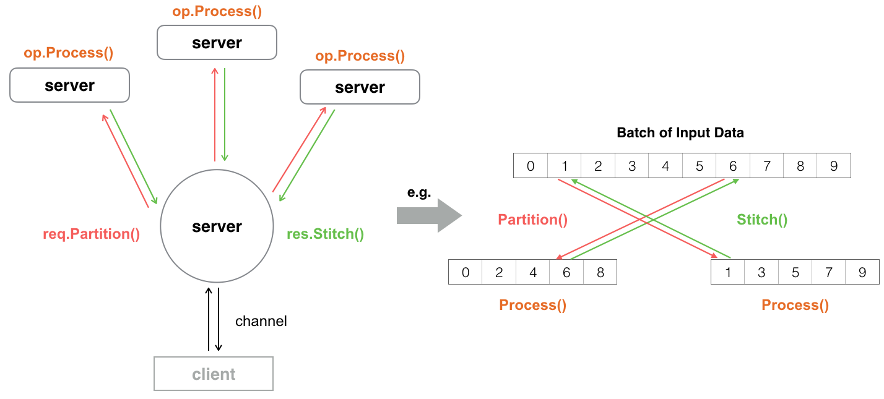

# Defining Your Own Operator

In **GL**, an **operator** is a basic executable unit.
The system function is represented by the operators.
For example, a graph sampler is a kind of operator.
Operators can be **extended** according to requirements.
Usually, we just focus on the local implementation when customizing an operator.
The system framework will help run it distributedly.

## Programming Interface

To customize an **operator**, class [**Operator**](../graphlearn/core/operator/operator.h) should be inherited.
And then override the following virtual function.

```c++
virtual Status Process(const OpRequest* req, OpResponse* res) = 0;
```

If you just want to implement a kind of neighborhood **sampler**,
inheriting from class [**Sampler**](../graphlearn/core/operator/sampler/sampler.h) may be an easy way.

The context of each **operator** is [**OpRequest**](../graphlearn/include/op_request.h) and [**OpResponse**](../graphlearn/include/op_request.h).
Two kinds of data map are contained in the context. `params_` is the description of the context.
It is usually made up of some **scalar** [**Tensor**](../graphlearn/include/tensor.h), such as "node type" and "sampling strategy".
`tensors_` is the body of the context. It usually takes data **vectors**.
For example, sampling one-hop neighbors for a batch of node ids, in which the ids should be put in `tensors_`.

In distributed mode, the graph data will be partitioned into serveral servers.
When a server receives an operator execution request, part of the request may be **redirected** to other servers.
The data that needs to be partitioned should be placed into `tensors_`, and rewrite the **Partition()** function.

Till now, we have abstracted the partition rules for all the existed operators.
You can just use the [**Partitioner**](../graphlearn/core/partition/partitioner.h) in most cases.


## Distributed Runtime Design

**GL** follows the principle that the **computation happens where the data is placed**.
In distributed mode, all severs can communicate with each other and know the distribution of the partitioned data.
When an operator request received, the server will push the partitioned requests to the right servers instead of pulling the data back.
Some operators may return responses that need to be **stitched** together, and some may just compute in place of the corresponding raw data.

As above, we propose the **Partition-Stitch** computing pattern for operators.
Developers just need care about the next three functions **Partition()**, **Process()**, **Stitch()**.




## Implement a New Operator

### Clone source code

To **implement** an operator, you should clone the source code first.

```bash
git clone https://github.com/alibaba/graph-learn.git
git submodule update --init
```

Refer to [building from source](install.md#build-from-source) to build pass.

### Implement your operator class

```c++
class MyOperator : public Operator {
public:
  Status Process(const OpRequest* req, OpResponse* res) override {
    //TODO
  }
};

```

If you need to rewrite the **Partition()** and **Stitch()**, you should customize request and response class,
which inherits from **OpRequest** and **OpResponse**.

### Register Operator

Each operator has a **unique name**. Register the operator with its name and class name.

```c++
REGISTER_OPERATOR("OpName", MyOperator);
```

Please make sure that the registered name should be the same with **OpRequest.Name()**.
Refer to an existed operator, such as [**RandomSampler**](../graphlearn/core/operator/sampler/random_sampler.cc) for details.

### Compile

```
cd graph-learn
make clean
make test
```

Usually, writting a C++ test is the fast way to check errors.
After that, you can make the python package and install it.

```
make python
pip install dist/your_wheel_name.whl -U
```

## How to Use an Operator

For example, if a new sampler named **xxxSampler**, you can call it like this:

```python
g.sample(count).by("xxx")...
```

More information about **API** refer to [this](query.md).


[Home](../README.md)
